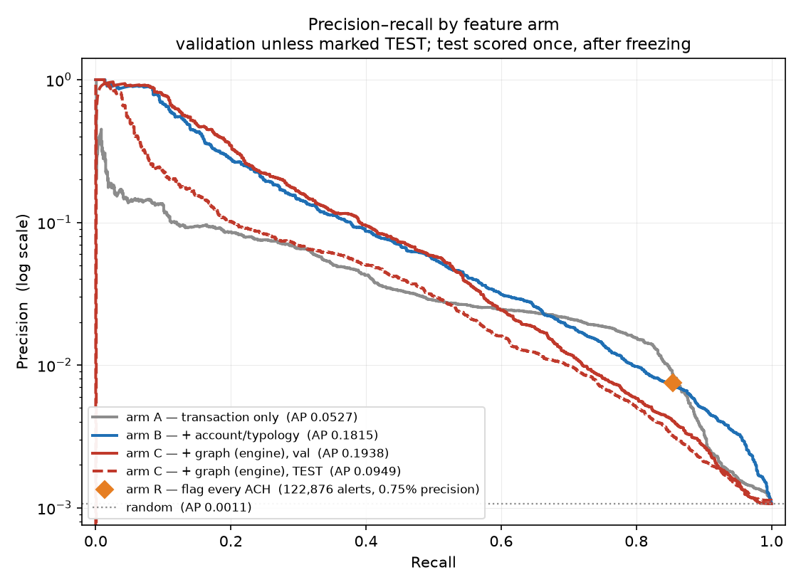
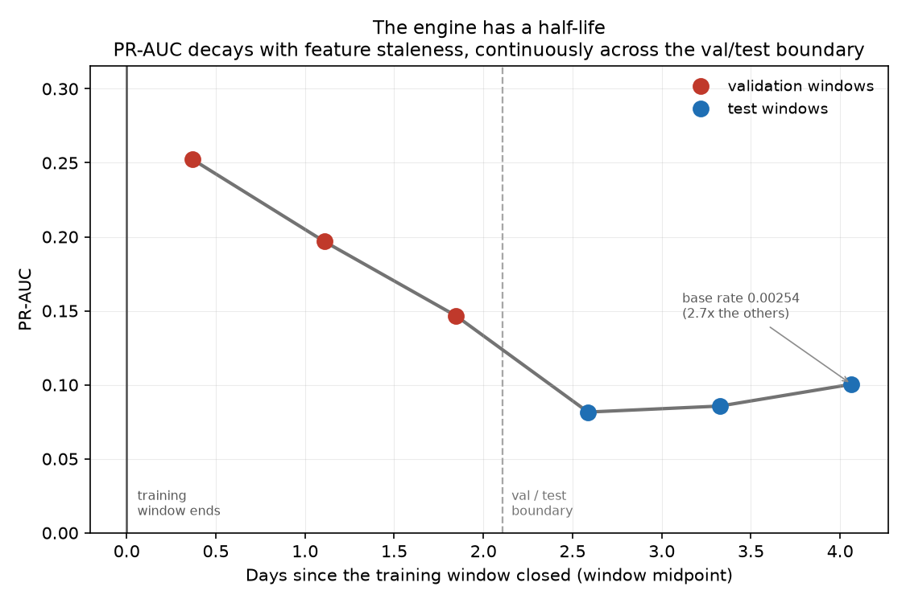

# AML Network Detection & Case Triage

**[▶ Live demo](https://aml-network-detection-triage.streamlit.app)** · [Build
log](docs/NOTES.md) · [Methodology](docs/METHODOLOGY.md)

Detects money-laundering **networks** in transaction data with graph-derived features on a
gradient-boosted model, then uses an LLM agent to triage the resulting alerts into cases and
draft investigator-ready notes. Both halves are measured against a control, and the half
that does not work says so.

```
transaction monitoring  ->  alert  ->  L1 triage  ->  L2 investigation  ->  SAR decision
   [ engine: arm C ]              [ agent: case triage ]
```

**Headline, stated honestly — which means with the intervals.**

The engine ranks well: PR-AUC 0.1938 on validation with precision@100 of 88%, against 0.1815
for a deliberately strong account-aggregate baseline. But that **+0.012 lift from graph
topology is at the edge of significance, not established** — paired 95% CI [-0.0025,
+0.0268], 95.3% of resamples favouring it. It is reported that way throughout rather than as
a settled number.

The agent's **disposition does not work at all** — its escalate/close decision is
statistically indistinguishable from the queue's base rate (Fisher exact, p=0.51), and an
earlier configuration that appeared to beat the control by 6.7 points turned out to be
Simpson's paradox. What it does deliver is measured too: complete, grounded, SAR-structured
case notes with 1 fabricated identifier across roughly 26,500 words of generated narrative.

Three headline numbers in this project did not survive being asked what a system doing no
work would score. Finding that out is most of what the repo is for.


## The problem is analyst capacity, not detection power

In 2018 the Bank Policy Institute surveyed 19 US banks holding $50bn–$500bn+ in assets. They
reviewed roughly **16 million alerts** and filed about **640,000 SARs** — a conversion rate
of **4%**. ([BPI, *Getting to Effectiveness*,
2018](https://bpi.com/getting-to-effectiveness-report-on-u-s-financial-institution-resources-devoted-to-bsa-aml-sanctions-compliance/);
the 4% is derived from their reported totals rather than taken from a vendor's rounded
"90–95%".)

Ninety-six percent of the work a monitoring system creates leads nowhere, and each item
still costs an analyst time. That sets what "better" has to mean here: **precision at a
fixed review capacity.** A model that finds more laundering by alerting on twice as much is
worthless to a team already unable to work its queue — which is why the headline metrics
below are PR-AUC and precision@k, not accuracy or ROC-AUC.

**The data.** IBM *Transactions for Anti-Money Laundering* (Altman et al., NeurIPS 2023
Datasets & Benchmarks), HI-Small. 1,015,300 validation transactions at a base rate of **1 in
937**. A companion `Patterns.txt` labels eight injected laundering topologies, which turns
pattern classification into a real labelled task rather than a rubric.


## Laundering behaviour → graph shape → feature → red flag

Features were chosen from named laundering behaviours, and the ranks below are the model's
actual LightGBM gain ordering — not a list of plausible-sounding features written after the
fact.

| Behaviour | How it appears in the data | Feature(s) | Reference |
|---|---|---|---|
| Layering through currency conversion | One account paying out across many different currencies in a short window | `from_out_n_currencies` (rank 1 by gain), `is_cross_currency` | FFIEC Appendix F — funds-transfer red flags (`ffiec-appendix-f`) |
| Funnel account / fan-in collection | Many unrelated payers into one account, little onward activity | `to_in_n` (rank 2), `to_in_n_counterparties`, `to_in_counterparties_per_txn` | FinCEN FIN-2014-A005 — funnel accounts (`fincen-fin-2014-a005`) |
| Burst velocity / smurfing | Inbound rate far above the account's own baseline | `to_in_txn_per_day` (rank 3), `from_in_txn_per_day` | FFIEC Appendix G — structuring (`ffiec-appendix-g`) |
| Placement via cash-like instruments | Concentration in payment formats associated with the placement stage | `from_layering_format_share` (rank 4), `to_layering_format_share`, `payment_format` | Placement stage; FATF virtual-asset indicators for the Bitcoin leg (`fatf-va-red-flags-2020`) |
| Network position — the hub a ring is built around | Money-weighted centrality no single-account aggregate can express | `to_pagerank` (rank 5), betweenness, Louvain community size | Our mapping from the injected shapes (`ibm-amlsim-typologies`) |
| Dormancy burst — the mule activation signature | An account quiet for a long stretch, then suddenly busy | `from_in_active_days` (rank 6), `to_gap_burstiness`, `to_median_gap_hours` | FinCEN FIN-2020-A003 — money-mule taxonomy (`fincen-fin-2020-a003`) |
| Layering across institutions | One customer's funds traversing many banks | `from_entity_n_banks` (rank 9), `is_same_bank`, `from_out_n_banks` | Layering stage; FFIEC Appendix F (`ffiec-appendix-f`) |
| Pass-through / mule signature | Money in approximately equals money out, nothing retained | `from_flow_through_ratio`, `from_retention_ratio`, `to_median_hours_to_forward` | FinCEN FIN-2020-A003 (`fincen-fin-2020-a003`) |
| Structuring below the CTR threshold | Amounts clustering just under $10,000 | **none — built, tested, dropped** | Enrichment is 2.79% in $9–10k against 2.96% in $10–11k: not a threshold effect. The simulator does not model reporting thresholds (`ffiec-appendix-g`) |

The last row is the one worth reading. The build plan called for structuring features and
round-number flags; both were **built, tested against the data, and dropped**. Shipping them
would have been domain-authentic theatre — features that signal knowledge of AML typologies
while detecting nothing. Testing whether a behaviour exists before building a feature for it
is the point.


## The engine

### Feature ablation — where the lift actually comes from

| Arm | Features | val PR-AUC | P@100 | |
|---|---|---|---|---|
| R — rules only: flag every ACH | 0 | 0.0066 | — | no model at all |
| A — transaction fields | 11 | 0.0527 | 20% |  |
| B — + account aggregates & typology features | 87 | 0.1815 | 88% | **the real baseline** |
| C — + multi-hop graph topology | 103 | 0.1938 | 88% | **the engine** |
| D — + node2vec embeddings | 231 | 0.0925 | 68% | rejected on evidence |

**Arm B is the baseline, and it was built to be hard to beat.** It carries every account
aggregate and every named-typology feature, so arm C's lift is attributable to multi-hop
topology rather than to the act of aggregating per account. Comparing graph features against
a transaction-only baseline would have produced a much larger and much less honest number.

Arm D added node2vec embeddings over the same graph and **did not beat explicit topology**
across three seeds and two dimensions. It is reported rather than dropped.

#### How solid is that lift? Less than it first looked

The arms above were compared by their 95% CIs, which overlap — the conservative reading, and
the only one available until the visibility experiment (see Limitations) began persisting
per-row scores for every arm. Both arms score the **same** validation rows, so the correct
test is paired, and it says something more careful than the table does:

> arm C over arm B: **+0.0123 PR-AUC, 95% CI [-0.0025, +0.0268]** — 95.3% of paired
> bootstrap resamples favour the graph features, and the two-sided interval just includes
> zero.

**That is at the edge of conventional significance, not established.** The direction is
consistent and the effect is where the domain argument predicts it, but on 1,083 validation
positives this dataset cannot separate a +0.012 PR-AUC difference from zero at 95%. The
honest claim is "graph topology probably helps, by about this much, and here is the
interval" — not "graph topology lifts PR-AUC from 0.1815 to 0.1938".

Reporting the point estimate alone would repeat exactly the error this project has now
caught three times: the agent's +6.7-point control lift that was Simpson's paradox, the
typology accuracy that lost to always guessing the majority class, and the FX materiality
threshold borrowed from a question it did not answer.

### The test split was scored exactly once

Every hyperparameter, feature arm and threshold was chosen on validation. The test split was
untouched until the engine was frozen, then scored once and fingerprinted
(`6b577bcf067ef11f`) so a silent re-score is detectable.

| | validation | test |
|---|---|---|
| PR-AUC | 0.1938 | 0.0949 |
| 95% CI | [0.1700, 0.2190] | [0.0788, 0.1137] |
| precision@100 | 88% | 54% |

The intervals do not overlap, so the drop is real and needs an explanation.

### Why the drop is not validation optimism

The obvious reading is that validation was overfitted. It was not, and the shape of the
decay is what rules it out. Sliced into time windows, PR-AUC falls *inside* validation
itself — 0.2523 → 0.1968 → 0.1465.

**Validation optimism predicts a step at the split boundary. Feature staleness predicts a
slope.** There is a slope. Account and graph features are built from the training window
only — the leak-free rule — and they decay at roughly half their signal per 1.5 days. A
cold-start explanation was tested first and rejected on measurement: coverage is identical
across splits (0.20% both) and the PR-AUC ratio is constant across coverage subsets.





### Currency normalisation, and a threshold that was measuring the wrong thing

62.68% of transactions are not in US dollars, so amounts must be converted before any amount
feature means anything. The rates were originally written from memory. They are now sourced
for **2022-09-01** from the ECB reference rates, the Bank of Russia, the SAMA peg and a
Bitcoin daily average — worst error in the original table **4.958%** (the Euro, which is 23%
of all rows).

Correcting them was treated as a measurement rather than an edit, because FX feeds every
amount feature *and* the money-weighted graph — so a swap would change the model and cascade
through the alert set, the case queue and the paid agent runs downstream.

| | val PR-AUC |
|---|---|
| frozen engine, as shipped | 0.1938 |
| frozen engine on corrected features (**inference** sensitivity) | 0.1984 — rank correlation ρ=0.9953 |
| retrained under corrected rates (**training** sensitivity) | 0.1844 |

The first version of this check used the reproducibility tolerance (0.002) as its
materiality threshold and returned MATERIAL. That constant answers a different question: it
verifies that re-running identical code on identical data returns an identical number.
Against an estimator whose own bootstrap SD is 0.0127, it flags 0.16 standard deviations as
meaningful.

Measured against the interval the project computed on Day 5 — before this question existed —
the retrained value sits **0.735 SD** from the frozen one, inside its 95% CI. Not
distinguishable from estimation noise on 1,083 positives. **The engine stays frozen and the
sourced table is recorded as provenance.**


## The agent

### The unit is a case, not an account

Per-account triage was built first and **measured not to work**. An account that receives
one payment and does nothing else is indistinguishable from an ordinary receipt when you can
only see its own rows — even when it is the receiving spoke of a fan-out. The agent
diagnosed this itself:

> "that counterparty's transactions are not in evidence here, so the pattern that alarmed
> the model cannot be verified from this account's side"

No prompt supplies a fact that is not in the context. So alerts are grouped into **cases** —
connected clusters of alerted accounts — and the hub and its spokes arrive in one dossier.
This is also the unit `Patterns.txt` labels, the unit compliance opens, and it costs 4.4×
fewer LLM calls.

### The disposition carries no signal — and the number that said otherwise was an artifact

| stratum | n | escalation precision | queue base rate | lift (pts) | Fisher p |
|---|---|---|---|---|---|
| overall | 53 | 42.5% | 41.5% | +1.0 | 0.5115 |
| 1-2 | 43 | 29.7% | 30.2% | -0.5 | 0.7519 |

An earlier configuration beat the escalate-everything control by **6.7 points**. Broken out
by case size, its escalation precision sat on the base rate inside *every* bucket — 38.5%
against 38.7% among small cases, 83.3% against 85.7% among large ones. The lift was
**Simpson's paradox**: small cases have a lower base rate, the agent closed more
aggressively among them, and pooled precision rose without a single case being judged better
than chance.

**A pooled rate confounds judgement quality with subpopulation choice whenever the system
decides both.** Having a control was necessary and not sufficient.

Why it was never going to work: the engine is a gradient-boosted model over 103 features
including multi-hop topology; the agent reads a text summary of a subset. Re-ranking that
means improving on a model that used strictly more information.

### What the layer demonstrably is

| | test, 53 cases |
|---|---|
| case notes complete (introduction / body / conclusion) | 53 of 53 |
| fabricated transaction IDs in the citation list | **0**, on both splits |
| fabricated identifiers in ~26,500 words of narrative | **1** (1.9% of cases) |
| typology vs `Patterns.txt`, any-match | 58.3% (chance: 34.4%) |
| typology, dominant-match | 50.0% (**majority-class baseline: 66.7%**) |
| typology, macro-F1 over 5 classes | 0.15 (**majority-class baseline: 0.16**) |
| cost per case | $0.0123 |
| median latency | 27.9s |

The case note follows FinCEN's SAR narrative template — introduction, body, conclusion —
**enforced by the output schema** rather than requested in prose, so a model under length
pressure cannot drop the conclusion, which is the only section that tells the next reviewer
what to do.

The grounding check covers **prose as well as the structured citation field**. Before that
it did not, and a fabricated identifier inside the body of a note was undetectable.

Typology accuracy is computed on the 12 cases whose members touch a named ring in the scored
window; 10 productive cases have laundering the simulator did not group into a ring and are
excluded rather than scored against none.

**Typology needs a control too, and it nearly shipped without one.** Two things make a bare
accuracy misleading here. *Any-match* is not a fixed-difficulty task — a large case touches
many injected rings, and one 11-account case has all eight typologies in its truth set, so
"the label is one of the types present" is close to free wherever the case is big. The
honest chance rate is per-case: 34.4%, against which 58.3% is a real but modest lift.
*Dominant-match* has a fixed 12.5% chance rate but a badly skewed class distribution:
**always predicting GATHER-SCATTER scores 66.7%**, and the agent scores 50.0%.

So the agent does **not** beat the trivial baseline on typology. **Macro-F1 was added to
test whether that verdict was an artifact of the metric** — accuracy averages over cases and
so rewards the majority class, whereas macro-F1 averages over classes and should punish a
baseline that never names the other seven. It punishes it, and the agent scores lower still:
0.15 against 0.16, because it names no minority typology correctly either. Both arms are
scored over the same class set, since macro-F1 divides by the number of classes averaged
over and an arm predicting a typology that never occurs would otherwise be penalised on the
denominator alone.

At twelve labelled cases none of these figures is well determined — which is the point. Each
is reported with its control and its sample size rather than on its own, the same way the
disposition was.

### Field order in a structured output is generation order

Structured output is emitted in schema-property order — verified by reading the key order
off a returned record. With `disposition` declared first, **"escalate" was the model's first
output token**, produced before a word of analysis existed.

| declaration order | escalation precision | TP lost | fabricated IDs in prose |
|---|---|---|---|
| decision first, note last | +6.7 pts | 37.5% | 0 |
| note first, decision last | −0.2 pts | 29.2% | **2** |
| **evidence → note → decision** (shipped) | −3.0 pts | 29.2% | **0** |

A committed citation list is what bounds what the prose may say; a decision emitted first is
one the prose then serves. The shipped ordering keeps both properties. It is the worst of
the three on disposition precision, which is not a reason to reject it — at p=0.24 that
ranking is noise, and choosing on noise is how a project talks itself into a result.

### Does retrieval earn its place?

| | retrieval on | off | |
|---|---|---|---|
| typology any-match | 7/12 | 4/12 | Fisher p=0.2068 — **not significant** |
| red-flag indicators per case | 2.736 | 1.057 | Mann-Whitney p=4.29e-08 |
| notes naming no indicator at all | 3 of 53 | 35 of 53 | |

The typology delta looks like the headline and is the one that cannot carry it — twelve
labelled cases. The indicator result is overwhelming and is the actual finding: **retrieval
is what makes the note cite published regulatory indicators instead of asserting suspicion
in its own voice.** It was never going to make the model a better ranker.


## One case, end to end

`CASE-TEST-002`, from the test queue. Chosen because it shows the layer working *and*
contains the single fabricated identifier in the entire test run — a walkthrough that only
shows the win is an advert.

**What the engine handed over.** 11 alerted accounts that transact with each other, grouped
into one case. The agent sees a dossier: the case's structure, a per-member summary, up to
40 citable transactions, SHAP attributions for the highest-scoring members, and retrieved
regulatory passages. It does **not** see the ground-truth label, the other accounts in the
ring, or anything outside the case.

**What it wrote.** Disposition **escalate**, typology **GATHER-SCATTER**, confidence high,
citing 40 transactions across a 521-word note.

> This case involves 11 accounts exhibiting high-volume internal transfers and heavy receipt
> of funds from external parties, concentrated in Saudi Riyal. The case shows
> characteristics of a gather-scatter layering topology: funds flowing in from 23 external
> sources ($167.8k) are internally redistributed across the group, then dispersed outward to
> 9 external payees ($57.1k). The pattern is marked by dense interconnection among member
> accounts, rapid sequential transfers, and significant embeddedness scores flagged by the
> model, all consistent with money laundering through account-to-account layering.

**Was it right?** The case's members touch a named ring in `Patterns.txt` whose dominant
type is **GATHER-SCATTER** across 52 labelled transactions — so the topology call is
correct, and the case is genuinely productive.

The indicators it named, all from FFIEC Appendix F and the typology reference rather than
its own voice:

  - Many small, incoming transfers of funds are received, or deposits are made using checks and money orders
  - Funds transfer activity is unexplained, repetitive, or shows unusual patterns
  - Multiple personal and business accounts are used to collect and funnel funds to a small number of foreign beneficiaries

**Where it went wrong.** The note names account `148016:811C597B0`, which does not exist.
Both halves of it do: `119:811C597B0` is a member of this case, and `148016:811FCA7B0` is a
*different* member. The model spliced one member's bank prefix onto another's account
number.

That is a compositional error rather than an invention from nothing, and it is the only one
in 53 cases. It is also the reason the grounding check scans prose and not just the
structured citation list — checked against what the dossier **rendered**, so an account the
case contains but the dossier withheld counts as fabricated too. Before that check existed
this was undetectable.

**What it would cost to run.** $0.0123 per case, 27.9s median latency.


## Regulatory grounding

Laundering is conventionally described in three stages — **placement**, **layering**,
**integration** — and the features above target the middle one, because layering is what
leaves a graph signature. The FATF Recommendations and its published red-flag indicators are
the international standard; in the US, the BSA requires currency transaction reports above
**$10,000** and suspicious activity reports on FinCEN Form 111, which [31 CFR §
1020.320](https://www.ecfr.gov/current/title-31/subtitle-B/chapter-X/part-1020/subpart-C/section-1020.320)
requires within **30 calendar days** of initial detection, extendable to 60 where no suspect
has been identified.

Explainability here is a **compliance requirement, not a nice-to-have**: AML models fall
under model risk management expectations (SR 11-7), and an institution has to be able to
tell an examiner why an alert fired. That is why the agent is handed the model's own SHAP
attributions rather than being asked to re-derive suspicion, and why every retrieved passage
carries a source id registered in [`kb/sources.json`](kb/sources.json) — a RAG system that
cites unverifiable text is worse than one that cites nothing, because it manufactures
confidence the reader cannot check.

## Where this sits relative to production systems

The standard commercial stack is rules engine → ML scoring → case management with human
review, sold by vendors including NICE Actimize, Verafin, Feedzai, Hawk AI, Unit21 and
Sardine. This project is the middle layer plus the front of the third: the engine is
transaction monitoring, the agent is L1 triage, and case management, workflow, audit trail
and regulatory reporting are all out of scope. The graph-features-over-gradient-boosting
approach is not novel — it is roughly what the field does — and the contribution here is the
evaluation discipline around it rather than the architecture.

## Production monitoring

What would need watching if this ran for real:

- **Feature drift** — PSI on the feature distributions per scoring window. Given the
measured decay of roughly half the signal per 1.5 days, the account and graph tables would
need rebuilding on a schedule, not a static training window. This is the single biggest gap
between this project and something deployable.
- **Alert rate and precision** — alerts per day against reviewer capacity, and the
productive share of what gets escalated. A rising alert rate at falling precision is the
first symptom of drift reaching the queue.
- **Score distribution** — a shifting score histogram moves the effective threshold even
when the threshold constant has not changed.
- **Agent grounding** — the fabricated-identifier check is programmatic and cheap enough
to run on every case in production, which is the point of making it a set operation rather
than a review step.

## How this was built

This project was written with an AI coding assistant (Claude Code) throughout, in a tight
loop: each step specified and reviewed before the next began. The assistant wrote most of
the code and much of the prose; the experimental design, the choice of controls, and the
reading of the results are mine.

That division is why the controls exist. Generated output is plausible by construction, and
plausible is not the same as correct — so every headline here is stated against what a
system doing no work would also score. Three did not survive it: the graph lift, now
reported as an interval rather than a point estimate; the agent's disposition lift, which
turned out to be Simpson's paradox; and a typology accuracy that lost to always guessing the
majority class. The build log records each one, along with the bugs a passing test suite
hid.

## Limitations

Stated plainly, because they are the first thing a reviewer should ask about.

- **The data is synthetic.** IBM's generator injects laundering patterns; real laundering
is not drawn from eight named topologies. Nothing here transfers directly.
- **Full inter-bank visibility is a synthetic-data luxury, and this dataset cannot quantify
what it is worth.** The plan was to re-run the engine on one bank's visible subgraph. There
are **30,528 banks** here with a median of **4 accounts**, and the only one large enough to
test turns out to be a clearing entity — **15 accounts carrying 452,751 transactions** with
zero internal transfers, on whose slice the engine scores below chance. Degrading the graph
by a random fraction instead is inconclusive for a different reason: at 25% visibility the
PR-AUC spans 0.1421–0.1904 across 3 draws depending purely on *which* edges are sampled — a
spread of 0.048, several times the graph lift itself. **Which edges you see swamps how
many.** Full detail in [docs/NOTES.md](docs/NOTES.md); the numbers are in
`results/single_bank.json`.
- **No entity resolution.** Real AML operates on customers who hold many accounts across
many institutions. This works at the account level, with only a static account-to-entity
mapping.
- **A short window.** Roughly 11 days of training data, which is why feature staleness
dominates the val→test drop and why the temporal split is tighter than production would ever
be.
- **The agent's disposition is not usable.** It is reported because it was measured, not
because it works.
- **`Patterns.txt` labels only 56.5%** of surviving laundering transactions, so
typology accuracy is computed on a labelled subset and the count travels with the metric.

## Reproducing this

```bash
# Python 3.13 — see docs/NOTES.md for why 3.14 does not work
/Library/Frameworks/Python.framework/Versions/3.13/bin/python3.13 -m venv .venv
./.venv/bin/python -m pip install -r requirements.txt
make fix-libomp        # macOS without Homebrew: repair LightGBM's OpenMP link

make check             # verify the environment
make all               # raw data -> every reported number
make test              # leakage, split, cache-provenance and grounding assertions
```

Credentials go in `.env` (copy `.env.example`). Nothing secret is committed. The agent half
needs an `ANTHROPIC_API_KEY`; every reported agent number is already in
`results/agent.json`, so the repo is readable without one.

## Repo layout

| Path | Contents |
|---|---|
| `src/` | Pipeline: features, graph, training, evaluation |
| `src/agent/` | Case construction, dossiers, triage, budget guard, evaluation |
| `app/` | Streamlit demo — reads committed results only |
| `kb/` | Retrieval corpus, every document registered in `sources.json` |
| `results/` | Metrics JSON and figures. **The README is generated from these** |
| `docs/NOTES.md` | Build log: decisions, dead ends, and the bugs worth remembering |
| `docs/METHODOLOGY.md` | The methodological arguments in full |
| `tests/` | Leakage, split, cache-provenance and agent-grounding assertions |
| `data/`, `models/` | Gitignored; regenerated by `make data` and `make eval` |

## Licence

MIT — see [`LICENSE`](LICENSE). That covers the code. `kb/corpus/` reproduces regulatory
text from FFIEC, FinCEN and the eCFR, which are US Government works and not subject to
copyright; every document is registered with its source and URL in
[`kb/sources.json`](kb/sources.json). The IBM transaction dataset carries its own terms and
is not redistributed here — `data/` is gitignored and rebuilt by `make data`.

---

**Manan Ahuja** · [LinkedIn](https://www.linkedin.com/in/mananahuja26)

*Numbers in this README are generated from `results/*.json` by `src/make_readme.py`;
`results/readme_provenance.json` records the source path of every one.*
